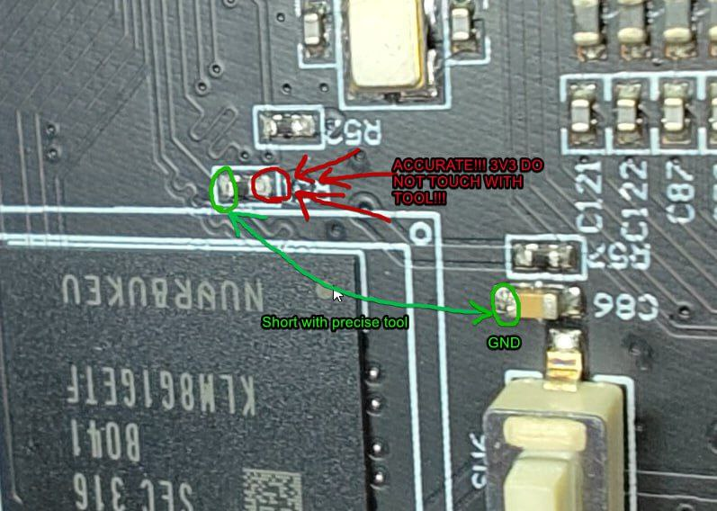

# All info about FEL/XFEL

To enter FEL mode, you can either use the xfel tool or short the pads on the main board.

The easiest way is to boot it via u-boot with the command:

```sh
efex
```

This will make the printer boot into FEL mode.

Or you can short the pads on the main board. The pads are located near the EMMC chip. You need to short the pads like in the picture below and then power on the printer and it will boot into FEL mode due to the shorted pads.



To be able to properly use the xfel tool, you need to install the driver which can be found in the [zadig](https://github.com/xboot/xfel/releases/) tool.

Make sure to go to "Options" and check "List All Devices" and then select "Allwinner USB Boot Device" or something with weird characters and then select "WinUSB" and click "Install Driver".
