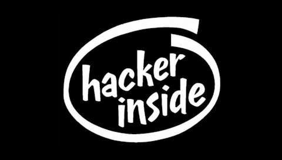

# Alternate bootlogos

To apply a new bootlogo, ssh into your printer first. Run the command `ssh root@ip.of.your.printer` to log into your printer. The password is `OpenCentauri`.

### Lines1

Made by `.earthworm.` on the OpenCentauri Discord

Apply with command `/bootlogos/swap.sh lines1`

### Lines2

Made by `.earthworm.` on the OpenCentauri Discord

Apply with command `/bootlogos/swap.sh lines2`

### Lines3

Made by `.earthworm.` on the OpenCentauri Discord

Apply with command `/bootlogos/swap.sh lines3`

### Hackerinside

Made by [Sims](https://github.com/suchmememanyskill/)

Apply with command `/bootlogos/swap.sh hackerinside`

### Gradient

Made by [mon5termatt](https://github.com/mon5termatt)

Apply with command `/bootlogos/swap.sh gradient`

### Official

Made by [Elegoo](https://github.com/elegooofficial)

Apply with command `/bootlogos/swap.sh official`